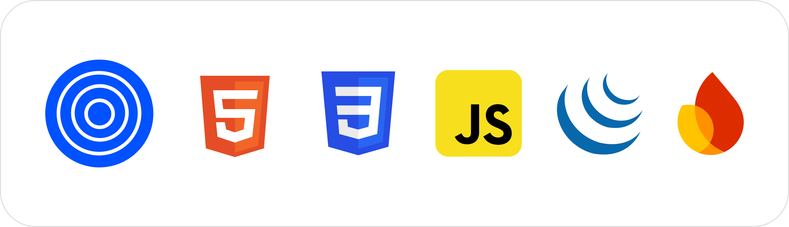

# Salo - Wholesale Distribution Management System

Salo is a comprehensive and user-friendly web application for managing wholesale distribution efficiently. Built using **HTML**, **CSS**, **JavaScript/jQuery**, and **Firebase**, Salo empowers businesses to handle:

- Companies  
- Products
- Order Bookers 
- Customers
- Purchases Orders
- Sales  
- Orders  

Everything in one seamless, intuitive platform.

---

## Features

Add, update, and delete products  
Manage multiple companies and their product inventories  
Register and manage customers and order bookers  
Record and track purchase and sales transactions  
Secure authentication using Firebase  
Real-time database integration  
Mobile responsive, clean and user-friendly UI

---

## Technologies Used

- HTML5  
- CSS3  
- JavaScript / jQuery  
- Firebase (Authentication + Realtime Database)

  

